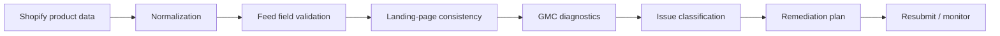

# Google Merchant Center Feed Diagnostics Toolkit

> **Structured diagnostics for Shopify product feeds, landing-page consistency and GMC remediation.**

[](https://github.com/beltebaiken-star/gmc-feed-diagnostics-toolkit)
[](https://github.com/beltebaiken-star/gmc-feed-diagnostics-toolkit/actions/workflows/demo-check.yml)
[](https://www.upwork.com/freelancers/baikenbelte)

## Client problem

GMC issues are frequently misdiagnosed because feed-field errors, landing-page mismatches and account-level policy problems are mixed together.

## What this project proves

This project separates structural product-data validation from policy/remediation workflow and includes a runnable synthetic feed diagnostic.

## Architecture



## Quick start

```bash
git clone https://github.com/beltebaiken-star/gmc-feed-diagnostics-toolkit.git
cd gmc-feed-diagnostics-toolkit
npm test
```

**What the demo checks:** Checks required product fields, price format, availability values and HTTPS landing/image URLs.

No external credentials or paid services are required for this demo.

## What I would deliver on a client project

- Feed and product-data audit
- Price/availability consistency checks
- GTIN / brand / MPN review
- Landing-page consistency review
- Issue classification by data vs policy layer
- Remediation checklist
- Post-fix verification plan

## Production QA principles

- Diagnose the failing layer before changing production code.
- Keep identifiers, values and platform mappings consistent end-to-end.
- Test both success and failure paths.
- Check for duplicates, missing events/data, and stale configuration.
- Reconcile platform output against Shopify/store source-of-truth data.
- Document the fix and leave a repeatable verification checklist.

## Repository map

```text
demo/                 runnable synthetic validation
examples/             safe sample payloads / implementation snippets
docs/architecture.md  technical architecture notes
docs/qa-checklist.md  production verification checklist
README.md              client-facing case study
```

## Security & portfolio note

This repository is a **sanitized technical portfolio demo**. It intentionally excludes customer data, production credentials, private URLs, access tokens and proprietary client code.

## Hire / contact

I take on focused Shopify, ecommerce tracking, analytics, GMC and integration projects.

**Upwork:** https://www.upwork.com/freelancers/baikenbelte
